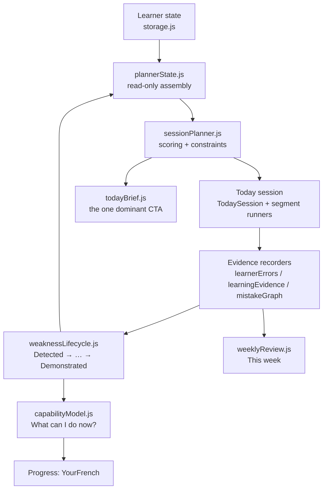

# Architecture — Le Studio learning core

This document describes the learning-behaviour architecture after the product
work of October 2026: one coherent adaptive loop where the app identifies what
the learner cannot yet use reliably, practises it, then verifies independent
use later and in a different context.

## The loop

## Module boundaries

Planning lives OUTSIDE React. `TodaySession.jsx` renders segments and records
outcomes; it never decides what to practise.

| Module | Responsibility |
|---|---|
| `lib/plannerState.js` | Reads persisted learner state and hands the planner one plain object. The only place that knows both storage shapes and planner inputs. |
| `lib/sessionPlanner.js` | Scores practice candidates with named factors (SCORE_FACTORS), applies session constraints (no three-in-a-row activity types, target saturation caps, speaking/listening floors, receptive/productive alternation, occasional easy wins), sequences the session along the Warm-up → Input → Speaking → Repair → Transfer → Retrieval arc. |
| `lib/followUp.js` | Turns ONE owed check into ONE concrete task the session can really run: unseen items on the same authored rule, or the word used in a new sentence. Returns `null` when no honest task exists, so the session promises nothing rather than repeating the drill. Grades production deterministically and offline. |
| `lib/todayPlan.js` | Builds the frozen segment plan for one session (the former `useMemo` body of TodaySession), including the study-arm gating, drill-slot registry call and learner-facing explanation layer. |
| `lib/todayBrief.js` | The Today dashboard's one dominant CTA ("Start today's session — 14 min") plus ≤3 reason lines and the outcome line. Composed from the same planner the session uses. |
| `lib/weaknessLifecycle.js` | Learner-facing weakness states: Detected → Confirmed → Repairing → Improving → Transfer check → Delayed confirmation → Demonstrated, with Recurred reopening the cycle. Mistake confidence bands (single / uncertain / repeated / persistent) keep one-off slips quiet. |
| `lib/capabilityModel.js` | Performance-derived capability statements ("You can reliably…" / "Still developing" / "Keep practising") — never XP, never manual checkboxes. |
| `lib/speakingTransfer.js` | Correction triage (meaning/grammar/vocabulary/intelligibility vs style), fresh-context transfer challenges, and what a transfer pass proves (never mastery alone). |
| `lib/scenarioProgression.js` | Scenario difficulty levels (1 basic task → 4 natural conversation) earned by demonstrated performance, with stale-level decay. |
| `lib/vocabKnowledge.js` | Per-word Recognition / Production / Listening bands from FSRS dual cards; listening stays `unknown` without real listening evidence. |
| `lib/listeningProgression.js` | Track metadata (honest provenance: synthetic vs recording, licence never fabricated) and the slow-clear → normal → speakers → accents → spontaneous → noise ladder. |
| `lib/fieldNotesActivities.js` | Turns a saved real-life phrase into recognition / recall / completion / speaking / pronunciation / fresh-context activities. |
| `lib/writingRepair.js` | After free writing: group errors, select the ≤3 most worth learning, compare (Your version / Improved / Why), repair by typing, rewrite. |
| `lib/weeklyReview.js` | The weekly summary from real activity only — honest zeros, no fabricated minutes. |
| `lib/instrumentation.js` | Local-only pilot events (session start/completion, dropout point, transfer/delayed results) and the research export. No learner text ever leaves the device. |

## Owed checks are run, not promised

The model's last two links — a fresh-context transfer check and a delayed
retest — are only real if something administers them. Each question has one
owner, and the session obeys all of them:

| Question | Single owner |
|---|---|
| What does the model still owe? | `learningEvidence.dueLearningChecks` — used by `plannerState`, `todayPlan` and Progress alike |
| What would a clean pass prove? | `learningEvidence.evidenceStrengthScore`; `followUp.proofFor` for the task |
| Can this event be called "delayed"? | `learnerErrors.evidenceStrength` — an explicit clock-verified flag, or an inference that clears `DELAYED_MIN_HOURS` |
| Can this event be called "transfer"? | Only a runner that administered and graded fresh material (`transferVerified`); never a mode name |
| Which task discharges this debt? | `followUp.followUpTask` — `null` when no honest task exists |

Three consequences worth stating plainly:

- **A transfer claim is earned, never asserted.** The old rule trusted
  `mode: 'held-out…'`, a name no ordinary practice produced — so the transfer
  lane stayed empty for every learner who did not join the opt-in study, and
  `Demonstrated` was unreachable. The follow-up check and the speaking loop's
  verified "use it somewhere new" step now set the flag instead.
- **A calendar boundary is not a delay.** Crossing local midnight can be ten
  minutes with the answer still on screen; inference now requires the real
  floor. A `delayed: true` from the scheduled-retest path is still honoured,
  because that path verifies the clock before setting it.
- **Silence is an honest answer.** With no runnable check, no segment is
  scheduled and nothing is promised. Listening, pronunciation, speaking and
  reading follow-ups return `null` today — playing another track is exposure,
  not evidence, and until the check itself can be graded against the weakness,
  the loop would rather say nothing than fake a pass.

Adding a follow-up task kind means teaching `followUp.js` to build it and
`FollowUpCheck.jsx` to run it; the planner, the curriculum and the due-check
machinery pick it up unchanged.

## Evidence honesty rules

Enforced in `weaknessLifecycle`, `learnerErrors` and `learningEvidence`, and
covered by tests:

- one isolated mistake is a slip (Detected), not a confirmed weakness
- one correct answer never implies mastery
- assisted success extends Improving but never demonstrates
- a fresh-context success proves transfer — the delayed retest is still owed
- Demonstrated needs independent use: in a new situation, and later
- missing evidence stays missing; it is never filled with an assumed result

## Learner-facing copy rules

Internal terminology never reaches the learner. Enforced by test assertions in
`tests/weakness-lifecycle.test.js`, `tests/session-planner.test.js`,
`tests/today-brief.test.js`, `tests/capability-model.test.js` and
`tests/speaking-transfer.test.js` (forbidden strings include "evidence",
"engine", "candidate", "calibration", "transfer evidence", "insufficient").
Preferred phrasings:

| Internal | Learner |
|---|---|
| Transfer evidence unavailable | We haven't seen you use this independently in a new situation yet. |
| Recurrence detected | This came back after you had improved it, so we're practising it again. |
| Insufficient evidence | Keep practising — a few more attempts and we can judge this properly. |

## Where to add a new activity type

1. Add its segment kind to `sessionPlanner.js` (`SESSION_ARC`, weights, label)
   and a candidate builder in `scoreCandidates`.
2. Add a runner in `TodaySession.jsx`'s segment switch (keep the runner's
   recording consistent with the other segments).
3. Give it learner copy in `segmentExplain.js`'s name map.

Nothing else needs to change: the planner constraints and the Today brief pick
it up automatically.

## Preservation notes

Local-first operation, no-account use, BYO AI key, shared relay support, secret
scanning, study consent, transcript privacy and offline fallback are unchanged.
All new evidence and instrumentation flows through the same local stores and
respects the same consent gates. XP and streaks remain but are secondary:
Today's headline is "3 skills practised · 1 weakness improved · 2 reviews
completed", not "+80 XP".
